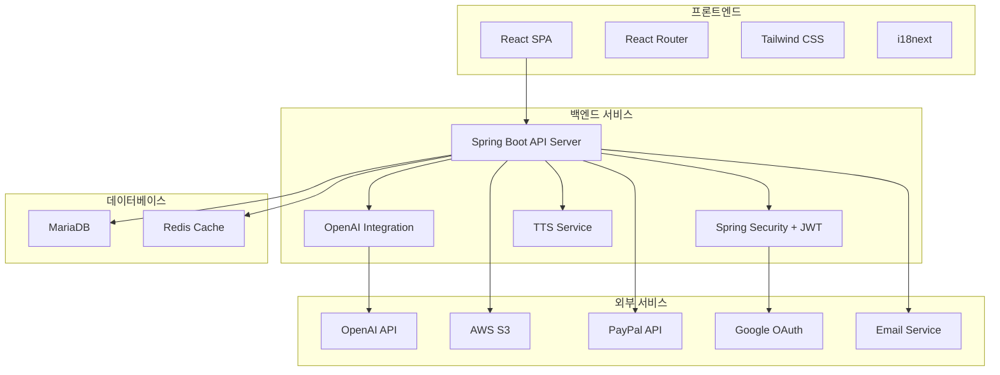
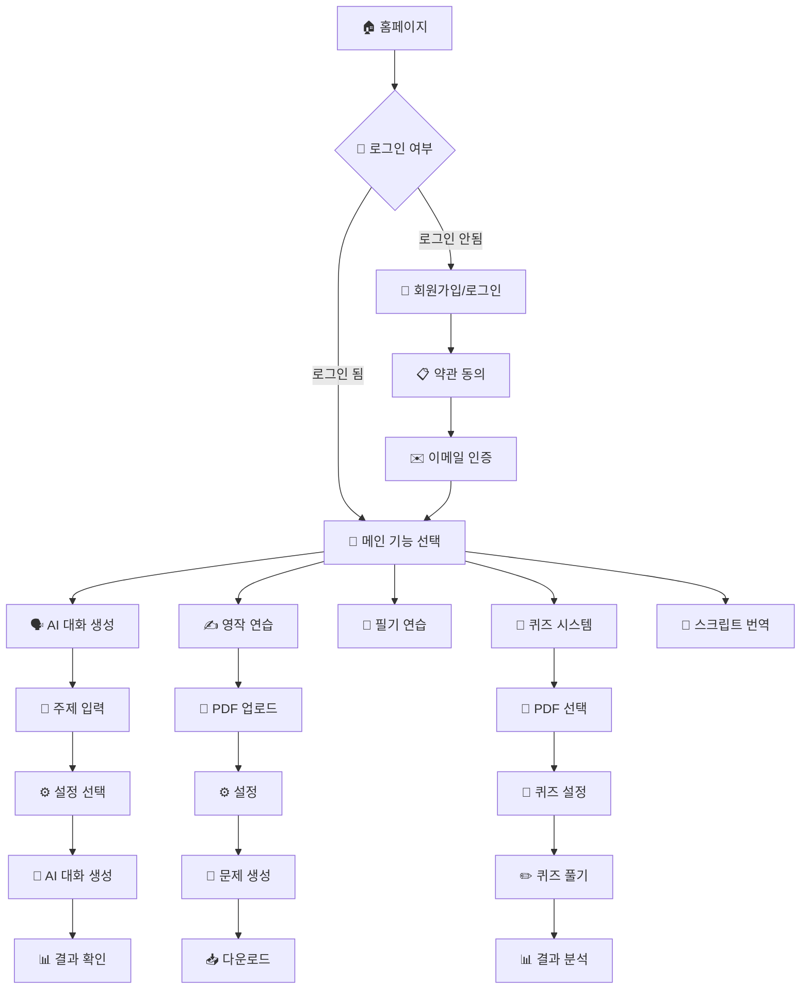

 # LingEdge - AI Language Learning Platform 🌟

**🌍 Language / 언어: [한국어](#korean) | [English](#english)**

<div align="center">
  
  
  <br/>
  
  
  
  
  
  
  
</div>

---

<a name="korean"></a>
## 🇰🇷 한국어

**LingEdge**는 AI 기반의 종합 언어 학습 플랫폼입니다. React 프론트엔드와 Spring Boot 백엔드로 구성된 풀스택 웹 애플리케이션으로, 대화형 학습, 영작 연습, 퀴즈 생성 등 다양한 기능을 통해 효과적인 언어 학습 경험을 제공합니다.


### 🌐 라이브 서비스

**🚀 [LingEdge 웹사이트 바로가기](http://www.lingedge.com)**

> 실제로 운영 중인 서비스를 체험해보세요! 회원가입 후 모든 기능을 사용할 수 있습니다.

### ✨구조도 


### ✨ 주요 기능

#### 🗣️ AI 대화 생성 시스템
- OpenAI GPT-3.5-turbo를 활용한 맞춤형 대화 생성
- 7개 언어 지원 (한국어, 영어, 일본어, 중국어, 스페인어, 프랑스어, 독일어)
- 난이도별 대화 생성 (초급/중급/고급)
- 실시간 번역 및 어휘 추출
- TTS(Text-to-Speech) 기능

#### ✍️ 영작 연습 시스템
- PDF 기반 영작 문제 자동 생성
- 난이도별 문제 출제
- 맞춤형 학습 콘텐츠 제공
- 학습 결과 PDF 생성

#### 📝 필기 연습
- 한글/영어 필기 템플릿 생성
- 사용자 맞춤형 연습지 제작
- PDF 다운로드 지원

#### 🧠 퀴즈 시스템
- PDF 문서 기반 자동 퀴즈 생성 (객관식/주관식)
- 실시간 채점 및 결과 분석
- 성과 추적 및 통계

#### 📄 스크립트 번역기
- 다국어 스크립트 자동 감지 및 번역
- 문단별 상세 분석 (요약, 어휘, 예상 질문)
- 음성 변환 및 저장

#### 👤 사용자 관리 시스템
- JWT 기반 인증/인가
- Google OAuth 소셜 로그인
- 이메일 인증 시스템
- 프리미엄/무료 사용자 구분
- 일일 사용량 제한 관리

#### 💳 구독 및 결제 시스템
- PayPal 결제 연동
- 구독 상태 관리
- 자동 갱신 및 취소

#### 🛠️ 관리자 대시보드
- 사용자 통계 및 분석
- 문의 관리 시스템
- 접속 로그 및 국가별 통계

#### ☁️ 파일 관리 시스템
- AWS S3 연동 파일 저장
- 자동 파일 만료 및 정리
- 사용자별 파일 저장 제한

### 🏗️ 시스템 아키텍처



### 🛠️ 기술 스택

#### 프론트엔드
| 기술 | 버전 | 용도 |
|------|------|------|
| **React** | ^18.2.0 | 사용자 인터페이스 구축 |
| **React Router DOM** | ^6.8.1 | 페이지 라우팅 및 내비게이션 |
| **Tailwind CSS** | ^3.2.7 | 유틸리티 기반 CSS 프레임워크 |
| **Axios** | ^1.3.4 | HTTP 클라이언트 API 통신 |
| **i18next** | ^22.4.13 | 다국어 지원 |
| **@react-oauth/google** | ^0.9.0 | Google OAuth 소셜 로그인 |
| **jwt-decode** | ^3.1.2 | JWT 토큰 디코딩 |

#### 백엔드
| 기술 | 버전 | 용도 |
|------|------|------|
| **Java** | 21 | 메인 프로그래밍 언어 |
| **Spring Boot** | 3.3.4 | 웹 애플리케이션 프레임워크 |
| **Spring Security** | 6.x | 보안 및 인증/인가 |
| **Spring Data JPA** | 3.x | 데이터베이스 ORM |
| **MariaDB** | 10.x | 메인 데이터베이스 |
| **OpenAI Java Client** | 0.18.2 | OpenAI API 연동 |
| **AWS SDK** | 1.12.395 | AWS S3 파일 저장 |
| **JWT** | 0.11.5 | 토큰 기반 인증 |

### 📊 주요 기능 플로우



### 🚀 설치 및 실행 방법

#### 필요 조건
- Node.js 18+ (프론트엔드)
- Java 21+ (백엔드)
- Maven 3.6+ (백엔드)
- MariaDB 10.x
- Redis (선택사항)

#### 1. 프로젝트 클론
```bash
git clone https://github.com/rmsals8/web-lingedge.git
cd web-lingedge
```

#### 2. 환경 변수 설정

**백엔드 환경 변수 (.env)**
```env
# 서버 설정
SERVER_PORT=8080

# 데이터베이스 설정
SPRING_DATASOURCE_URL=jdbc:mariadb://localhost:3306/lingedge
SPRING_DATASOURCE_USERNAME=your_db_username
SPRING_DATASOURCE_PASSWORD=your_db_password

# OpenAI API 설정
OPENAI_API_KEY=your_openai_api_key
OPENAI_MODEL=gpt-3.5-turbo

# JWT 설정
JWT_SECRET=your_jwt_secret_key
JWT_EXPIRATION_MS=1800000

# Google OAuth 설정
GOOGLE_CLIENT_ID=your_google_client_id
GOOGLE_CLIENT_SECRET=your_google_client_secret

# AWS S3 설정
AWS_ACCESS_KEY=your_aws_access_key
AWS_SECRET_KEY=your_aws_secret_key
AWS_REGION=ap-northeast-2
AWS_S3_BUCKET_NAME=your_bucket_name

# 프론트엔드 URL
FRONTEND_URL=http://localhost:3000
```

**프론트엔드 환경 변수 (.env)**
```env
# API 서버 URL
REACT_APP_API_BASE_URL=http://localhost:8080

# 구글 OAuth 클라이언트 ID
REACT_APP_GOOGLE_CLIENT_ID=your_google_client_id

# Stripe 공개 키 (선택사항)
REACT_APP_STRIPE_PUBLIC_KEY=your_stripe_public_key
```

#### 3. 데이터베이스 설정
```sql
CREATE DATABASE lingedge DEFAULT CHARACTER SET utf8mb4 COLLATE utf8mb4_unicode_ci;
```

#### 4. 백엔드 실행
```bash
cd backend
mvn clean install
mvn spring-boot:run
```

#### 5. 프론트엔드 실행
```bash
cd frontend
npm install
npm start
```

#### 6. 접속 확인
- 프론트엔드: `http://localhost:3000`
- 백엔드 API: `http://localhost:8080`

### 📊 데이터베이스 스키마

#### 주요 테이블

**users 테이블**
```sql
CREATE TABLE users (
    id BIGINT AUTO_INCREMENT PRIMARY KEY,
    username VARCHAR(20) NOT NULL UNIQUE,
    email VARCHAR(255) NOT NULL UNIQUE,
    login_type INTEGER NOT NULL DEFAULT 0,
    email_verified BOOLEAN NOT NULL DEFAULT FALSE,
    verification_token VARCHAR(255),
    created_at DATETIME NOT NULL,
    updated_at DATETIME NOT NULL
);
```

**quizzes 테이블**
```sql
CREATE TABLE quizzes (
    id BIGINT AUTO_INCREMENT PRIMARY KEY,
    user_id BIGINT NOT NULL,
    title VARCHAR(255) NOT NULL,
    created_at DATETIME NOT NULL,
    expire_at DATETIME,
    FOREIGN KEY (user_id) REFERENCES users(id)
);
```

### 🔌 API 명세서

#### 인증 관련 API
| Method | Endpoint | 설명 | 인증 필요 |
|--------|----------|------|-----------|
| POST | `/api/users/register` | 회원가입 | ❌ |
| POST | `/api/users/login` | 로그인 | ❌ |
| POST | `/api/users/google-login` | Google 소셜 로그인 | ❌ |
| DELETE | `/api/auth/logout` | 로그아웃 | ✅ |

#### AI 기능 API
| Method | Endpoint | 설명 | 인증 필요 |
|--------|----------|------|-----------|
| POST | `/bot/chat` | AI 대화 생성 | ✅ |
| POST | `/api/quizzes/generate` | 퀴즈 생성 | ✅ |
| POST | `/api/writing-exercises/generate` | 영작 연습 생성 | ✅ |
| POST | `/api/script/translate` | 스크립트 번역 | ✅ |
| POST | `/api/tts/generate` | 음성 생성 | ❌ |

#### 파일 관리 API
| Method | Endpoint | 설명 | 인증 필요 |
|--------|----------|------|-----------|
| GET | `/api/files` | 파일 목록 조회 | ✅ |
| GET | `/api/files/download/{id}` | 파일 다운로드 | ✅ |
| DELETE | `/api/files/{id}` | 파일 삭제 | ✅ |

### 📱 지원하는 언어

- 🇰🇷 한국어
- 🇺🇸 영어  
- 🇯🇵 일본어
- 🇨🇳 중국어
- 🇪🇸 스페인어
- 🇫🇷 프랑스어
- 🇩🇪 독일어
- 🇸🇦 아랍어
- 🇮🇩 인도네시아어
- 🇲🇾 말레이어
- 🇹🇭 태국어
- 🇧🇷 포르투갈어(브라질)

### 🎯 사용량 제한

#### 무료 사용자
- 일일 대화 생성: 3회
- 퀴즈 생성: 2개
- 영작 연습: 2개
- 파일 저장: 타입별 2개

#### 프리미엄 사용자
- 일일 대화 생성: 100회
- 퀴즈 생성: 무제한
- 영작 연습: 무제한
- 파일 저장: 타입별 무제한

### 🔒 보안 설정

#### JWT 토큰 설정
- **액세스 토큰**: 30분 만료
- **리프레시 토큰**: 7일 만료
- **암호화**: HS512 알고리즘 사용

#### CORS 설정
```java
@Configuration
public class WebConfig implements WebMvcConfigurer {
    @Override
    public void addCorsMappings(CorsRegistry registry) {
        registry.addMapping("/**")
                .allowedOrigins(frontendUrl)
                .allowedMethods("GET", "POST", "PUT", "DELETE", "OPTIONS")
                .allowedHeaders("*")
                .allowCredentials(true);
    }
}
```

### 💡 사용 팁

1. **개발 환경**: 백엔드를 먼저 실행한 후 프론트엔드를 실행하세요
2. **환경 변수**: API 키는 보안을 위해 환경변수로 관리하세요
3. **데이터베이스**: MariaDB 연결 시 UTF-8 인코딩을 반드시 설정하세요
4. **파일 업로드**: 대용량 파일 처리를 위해 멀티파트 설정을 조정하세요
5. **프리미엄 구독**: 더 많은 기능과 사용량을 원한다면 프리미엄 구독을 이용하세요

### 🐛 문제 해결

#### 자주 발생하는 문제

**1. CORS 오류**
```
해결책: 백엔드의 CORS 설정에서 프론트엔드 URL이 허용되어 있는지 확인하세요
```

**2. OpenAI API 연결 오류**
```
해결책: API 키가 올바른지 확인하고, 사용량 한도를 확인하세요
```

**3. 데이터베이스 연결 오류**
```
해결책: 데이터베이스 서버가 실행 중인지 확인하고, 연결 정보를 점검하세요
```

**4. JWT 토큰 오류**
```
해결책: 토큰 만료 시간을 확인하고, 리프레시 토큰으로 갱신을 시도하세요
```

### 📈 성능 최적화

#### 프론트엔드 최적화
- React.memo를 사용한 불필요한 리렌더링 방지
- 코드 스플리팅으로 초기 로딩 시간 단축
- 이미지 최적화 및 lazy loading

#### 백엔드 최적화
- 데이터베이스 인덱스 설정으로 조회 성능 향상
- 페이징 처리로 대용량 데이터 처리
- Redis 캐싱으로 응답 속도 향상

### 📄 라이선스

이 프로젝트는 개인 포트폴리오 목적으로 제작되었습니다.

> **💼 포트폴리오 프로젝트**: 상업적 사용이나 재배포를 원하시는 경우 [rmsals8@naver.com](mailto:rmsals8@naver.com)으로 문의해 주세요.

### 📞 문의

프로젝트에 대한 문의사항이 있으시면 언제든지 연락주세요!

📧 **이메일**: rmsals8@naver.com  
🐱 **GitHub**: [GitHub Profile](https://github.com/rmsals8)

---

<a name="english"></a>
## 🇺🇸 English

**LingEdge** is an AI-powered comprehensive language learning platform. It's a full-stack web application built with React frontend and Spring Boot backend, providing effective language learning experiences through various features including interactive learning, writing practice, quiz generation, and more.

### 🌐 Live Service

**🚀 [Try LingEdge Live](http://www.lingedge.com)**

> Experience the actual working platform! Sign up and use all features.

### ✨ Key Features

#### 🗣️ AI Conversation Generation System
- Customized conversation generation using OpenAI GPT-3.5-turbo
- Support for 7 languages (Korean, English, Japanese, Chinese, Spanish, French, German)
- Level-based conversation generation (Beginner/Intermediate/Advanced)
- Real-time translation and vocabulary extraction
- Text-to-Speech (TTS) functionality

#### ✍️ Writing Practice System
- Automatic writing exercise generation based on PDF
- Level-based problem generation
- Customized learning content provision
- Learning result PDF generation

#### 🧠 Quiz System
- Automatic quiz generation from PDF documents (Multiple choice/Short answer)
- Real-time grading and result analysis
- Performance tracking and statistics

#### 📄 Script Translator
- Automatic detection and translation of multilingual scripts
- Detailed paragraph analysis (summary, vocabulary, expected questions)
- Audio conversion and storage

#### 👤 User Management System
- JWT-based authentication/authorization
- Google OAuth social login
- Email verification system
- Premium/Free user distinction
- Daily usage limit management

#### 💳 Subscription and Payment System
- PayPal payment integration
- Subscription status management
- Automatic renewal and cancellation

### 🛠️ Tech Stack

#### Frontend
| Technology | Version | Purpose |
|------------|---------|---------|
| **React** | ^18.2.0 | User interface development |
| **React Router DOM** | ^6.8.1 | Page routing and navigation |
| **Tailwind CSS** | ^3.2.7 | Utility-based CSS framework |
| **Axios** | ^1.3.4 | HTTP client for API communication |
| **i18next** | ^22.4.13 | Internationalization |
| **@react-oauth/google** | ^0.9.0 | Google OAuth social login |

#### Backend
| Technology | Version | Purpose |
|------------|---------|---------|
| **Java** | 21 | Main programming language |
| **Spring Boot** | 3.3.4 | Web application framework |
| **Spring Security** | 6.x | Security and authentication/authorization |
| **Spring Data JPA** | 3.x | Database ORM |
| **MariaDB** | 10.x | Main database |
| **OpenAI Java Client** | 0.18.2 | OpenAI API integration |
| **AWS SDK** | 1.12.395 | AWS S3 file storage |

### 🚀 Installation and Setup

#### Prerequisites
- Node.js 18+ (Frontend)
- Java 21+ (Backend)
- Maven 3.6+ (Backend)
- MariaDB 10.x
- Redis (Optional)

#### 1. Clone the project
```bash
git clone https://github.com/rmsals8/web-lingedge.git
cd web-lingedge
```

#### 2. Environment Variables Setup

**Backend Environment Variables (.env)**
```env
# Server Configuration
SERVER_PORT=8080

# Database Configuration
SPRING_DATASOURCE_URL=jdbc:mariadb://localhost:3306/lingedge
SPRING_DATASOURCE_USERNAME=your_db_username
SPRING_DATASOURCE_PASSWORD=your_db_password

# OpenAI API Configuration
OPENAI_API_KEY=your_openai_api_key
OPENAI_MODEL=gpt-3.5-turbo

# JWT Configuration
JWT_SECRET=your_jwt_secret_key
JWT_EXPIRATION_MS=1800000

# Google OAuth Configuration
GOOGLE_CLIENT_ID=your_google_client_id
GOOGLE_CLIENT_SECRET=your_google_client_secret

# AWS S3 Configuration
AWS_ACCESS_KEY=your_aws_access_key
AWS_SECRET_KEY=your_aws_secret_key
AWS_REGION=ap-northeast-2
AWS_S3_BUCKET_NAME=your_bucket_name

# Frontend URL
FRONTEND_URL=http://localhost:3000
```

**Frontend Environment Variables (.env)**
```env
# API Server URL
REACT_APP_API_BASE_URL=http://localhost:8080

# Google OAuth Client ID
REACT_APP_GOOGLE_CLIENT_ID=your_google_client_id

# Stripe Public Key (Optional)
REACT_APP_STRIPE_PUBLIC_KEY=your_stripe_public_key
```

#### 3. Database Setup
```sql
CREATE DATABASE lingedge DEFAULT CHARACTER SET utf8mb4 COLLATE utf8mb4_unicode_ci;
```

#### 4. Run Backend
```bash
cd backend
mvn clean install
mvn spring-boot:run
```

#### 5. Run Frontend
```bash
cd frontend
npm install
npm start
```

#### 6. Access
- Frontend: `http://localhost:3000`
- Backend API: `http://localhost:8080`

### 📱 Supported Languages

- 🇰🇷 Korean
- 🇺🇸 English  
- 🇯🇵 Japanese
- 🇨🇳 Chinese
- 🇪🇸 Spanish
- 🇫🇷 French
- 🇩🇪 German
- 🇸🇦 Arabic
- 🇮🇩 Indonesian
- 🇲🇾 Malay
- 🇹🇭 Thai
- 🇧🇷 Portuguese (Brazil)

### 📄 License

This project was created for personal portfolio purposes.

> **💼 Portfolio Project**: For commercial use or redistribution, please contact [rmsals8@naver.com](mailto:rmsals8@naver.com).

### 📞 Contact

If you have any questions about the project, please feel free to contact us!

📧 **Email**: rmsals8@naver.com  
🐱 **GitHub**: [GitHub Profile](https://github.com/rmsals8)

---

**LingEdge와 함께 즐거운 언어 학습 되세요! | Enjoy language learning with LingEdge!** 🎉
